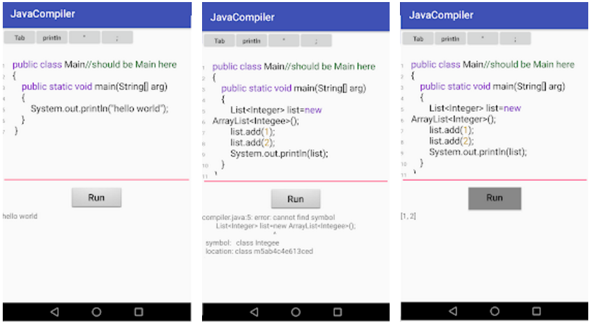

# app_java_compiler
Android APP for editing and running Java code.

# 1. screenshot

# 2. competitor analysis

* https://play.google.com/store/apps/details?id=com.duy.compiler.javanide
* https://play.google.com/store/apps/details?id=com.eagle.javacompilerjpdk
* https://play.google.com/store/apps/details?id=coding.yu.javacompiler
* https://play.google.com/store/apps/details?id=com.krazeapps.javacompiler
* https://play.google.com/store/apps/details?id=app.compiler

# 3. each app details

* Java N-IDE
   * support jdk 1.7
   * 界面复杂，支持多目录
   * 缺点：像IDE一样，太复杂
   * no G11n
* Java Compiler JPDK
   * 支持写代码，保存，加载文件
   * online compile（API已经暴露）
   * compile 非常慢
   * 缺点：界面丑陋
   * no G11n
* Java编译器
   * 支持写代码，保存，加载文件
   * 图标做的比较漂亮
   * 常用符号快速输入（Tab, {}, ;, \n）
   * 缺点：执行结果是用dialog弹出，不美观
   * G11n
   * AD: GOOGLE + XiaoMi
   * full screen AD: start, waitting
   * Tab AD
   * Editor: based on android.text.TextWatcher
   * Compile: online, self-build-server
      * http://www.anycodes.cn/web/cgi-bin/run.php
      * http://runcode-api2-ng.shucunwang.com/compile2

* Jedona
   * 代码高亮，界面最好
   * 看上去不错，但安装量少
   * very simple, access http://45.79.179.111/java-android/ directly
   * WebView, webChromeClient
   * G11n

* Online Compiler (Beta)
   * 支持很多编程语言
   * online compile
   * build self-api: http://compiler.programminghub.io/api/run

# 4. most important feature

* key obstacle [C]
   * compile java code
   * run java code
* open/save *.java file [X]
* good editor
   * background color [X]
   * search by keywords [X]
   * line number [C]
   * highlight keywords
   * auto tab [X]

# 5. users

# 6. installed countries

* 美国
* 俄罗斯
* 巴西
* 毛里塔尼亚
* 英国
* 德国
* 意大利
* 罗马尼亚
* 叙利亚
* 埃塞俄比亚
* 肯尼亚
* 马达加斯加
* 南非
* 印度
* 巴基斯坦
* 巴布亚新几内亚
* 菲律宾
* 韩国
* 也门
* 斯里兰卡
